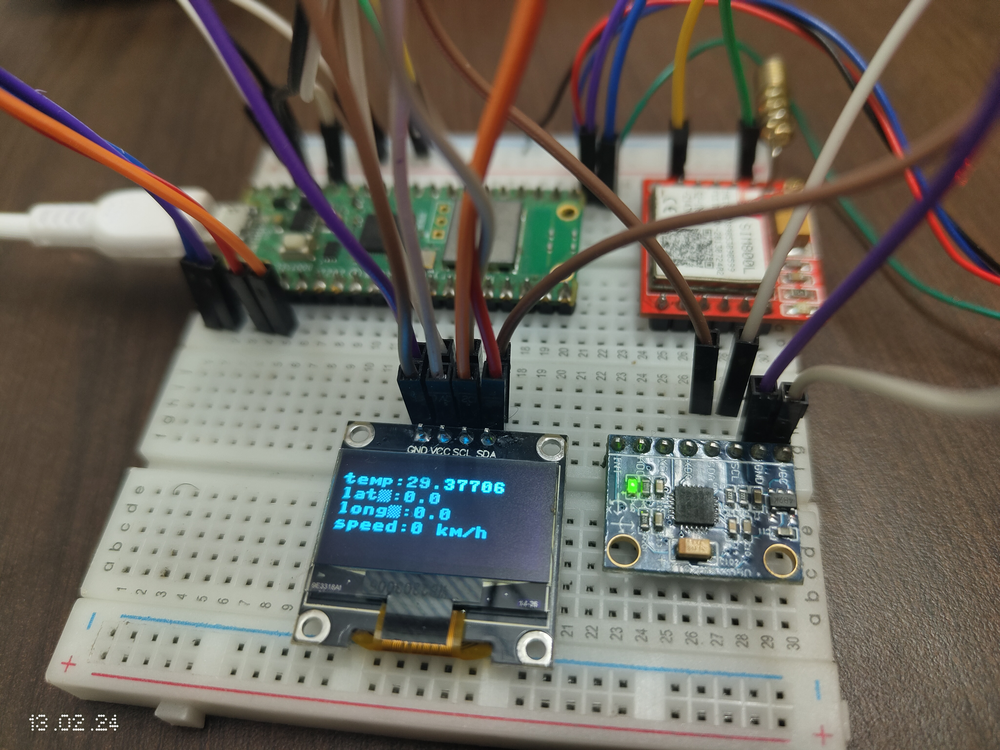

# Iot_based_GPS_vehicall_tracker

The main idea of this project is to track the current location of the vechicall and set the constrains lime maximum speed, maximum radious,remote lock,... and this also containd the fall detection. all the info for the tracker is convyed to the mqtt breaker then the data can be accessed by a mobile app.

